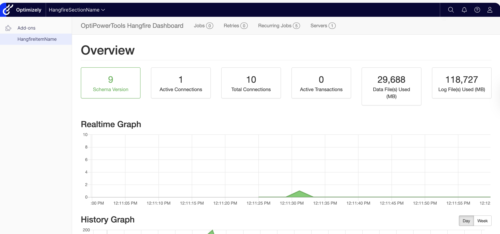

# OptiPowerTools.Hangfire

A one-liner bootstrap for adding [Hangfire](https://www.hangfire.io/) background job processing to [Optimizely CMS 12](https://www.optimizely.com/).

This package was inspired by community feedback on the blog post [Adding Hangfire to Optimizely CMS 12](https://szolkowski.github.io/2024/07/31/adding-hangfire-to-epi-12.html), which walked through the manual steps of integrating Hangfire with Optimizely. The recurring request for a ready-made, drop-in solution led to this library — turning what was a multi-step manual setup into a simple, drop-in integration.

## Features

- Single extension method to register Hangfire with SQL Server storage and background server
- Hangfire Dashboard with Optimizely role-based authorization out of the box
- CMS menu integration — dashboard appears in the Optimizely navigation bar with configurable placement
- [Hangfire.Console](https://github.com/pieceofsummer/Hangfire.Console) support for rich job output
- Configurable via options pattern or appsettings.json
- Custom dashboard authorization — bring your own `IDashboardAuthorizationFilter` or disable auth entirely for development
- Toggle individual features on/off (`EnableDashboard`, `EnableConsole`, `EnableCmsMenu`)
- Built-in job filters for concurrency control (`MutualExclusion`, `WaitForOtherJobs`) and lifecycle management (`ExpireOnSuccess`, `RetainOnSuccess`)
- Targets net6.0, net8.0, net9.0, net10.0



## Quick Start

```csharp
// In Program.cs or Startup.cs
services.AddOptiPowerToolHangfire(options =>
{
    options.ConnectionString = Configuration.GetConnectionString("HangfireConnection");
});

// In the middleware pipeline (after UseAuthentication/UseAuthorization)
app.UseOptiPowerToolHangfire();
```

Connection string can point to the same database as Optimizely or to separate one.

That's it. This registers Hangfire with SQL Server storage, starts the background server, enables the dashboard with role-based auth, and adds a menu item to the CMS navigation.

## Configuration

All options except `ConnectionString` have sensible defaults. Configure via code, appsettings.json, or both (code overrides config).

### Code configuration

#### Minimal configuration

```csharp
// Connection string is read from appsettings.json ("OptiPowerTools:Hangfire:ConnectionString")
services.AddOptiPowerToolHangfire();

app.UseOptiPowerToolHangfire();
```

#### Full configuration

```csharp
services.AddOptiPowerToolHangfire(options =>
{
    // Required
    options.ConnectionString = "Server=.;Database=MyDb;Trusted_Connection=True;";

    // Optional — all values below are the defaults
    options.DashboardPath = "/episerver/backoffice/Plugins/hangfire";
    options.DashboardTitle = "OptiPowerTools Hangfire Dashboard";
    options.AuthorizedRoles = ["Administrators", "CmsAdmins", "WebAdmins"];
    options.SchemaName = "hangfire";
    options.EnableDashboard = true;
    options.EnableConsole = true;
    options.EnableCmsMenu = true;
    options.EnableStandardAuthorization = true;

    // Menu placement — default is CmsSection (under the CMS nav section)
    options.MenuPlacement = CmsMenuPlacement.CmsSection;
    options.MenuPath = null;        // Override the auto-derived menu path
    options.MenuSortIndex = null;   // Override the auto-derived sort index
    options.CustomSectionName = "OptiPowerTools"; // Section name for CustomSection placement
    options.CustomMenuItemName = "OptiPowerTools"; // Display name for the menu item
    options.CmsShellPath = "/HangfireCms/Index";   // URL path for the CMS shell iframe page

    // Storage maintenance
    options.JobExpirationCheckInterval = TimeSpan.FromMinutes(15);
});
```

### appsettings.json

```json
{
  "OptiPowerTools": {
    "Hangfire": {
      "ConnectionString": "Server=.;Database=MyDb;Trusted_Connection=True;",
      "DashboardPath": "/episerver/backoffice/Plugins/hangfire",
      "DashboardTitle": "OptiPowerTools Hangfire Dashboard",
      "AuthorizedRoles": ["Administrators", "CmsAdmins", "WebAdmins"],
      "SchemaName": "hangfire",
      "EnableDashboard": true,
      "EnableConsole": true,
      "EnableCmsMenu": true,
      "EnableStandardAuthorization": true,
      "MenuPlacement": "CmsSection",
      "MenuPath": null,
      "MenuSortIndex": null,
      "CustomSectionName": "OptiPowerTools",
      "CustomMenuItemName": "OptiPowerTools",
      "CmsShellPath": "/HangfireCms/Index",
      "JobExpirationCheckInterval": "00:15:00"
    }
  }
}
```

### Options reference

| Option | Type | Default | Description |
|--------|------|---------|-------------|
| `ConnectionString` | `string` | `""` | **Required.** SQL Server connection string for Hangfire storage. |
| `DashboardPath` | `string` | `"/episerver/backoffice/Plugins/hangfire"` | URL path where the Hangfire dashboard is served. |
| `DashboardTitle` | `string` | `"OptiPowerTools Hangfire Dashboard"` | Title shown in the dashboard header. |
| `AuthorizedRoles` | `string[]` | `["Administrators", "CmsAdmins", "WebAdmins"]` | Optimizely roles allowed to access the dashboard. |
| `SchemaName` | `string` | `"hangfire"` | SQL Server schema for Hangfire tables. |
| `EnableDashboard` | `bool` | `true` | Serve the Hangfire dashboard UI. Set to `false` for worker-only nodes. |
| `EnableConsole` | `bool` | `true` | Enable Hangfire.Console for rich console output in jobs. |
| `EnableCmsMenu` | `bool` | `true` | Add a Hangfire menu item to the Optimizely CMS navigation. |
| `EnableStandardAuthorization` | `bool` | `true` | Use the built-in Optimizely role-based authorization filter for the dashboard. When `false` and no custom filter is provided, the dashboard allows unrestricted access. |
| `MenuPlacement` | `CmsMenuPlacement` | `CmsSection` | Where the menu item appears: `CmsSection`, `TopLevel`, or `CustomSection`. See [Menu Placement](#menu-placement). |
| `MenuPath` | `string?` | `null` | Overrides the auto-derived menu path. Takes precedence over `MenuPlacement` path logic. |
| `MenuSortIndex` | `int?` | `null` | Overrides the auto-derived sort index for the menu item (or section in `CustomSection` mode). |
| `CustomSectionName` | `string` | `"OptiPowerTools"` | Display name for the section group when `MenuPlacement` is `CustomSection`. |
| `CustomMenuItemName` | `string` | `"OptiPowerTools"` | Display name for the Hangfire menu item in the CMS navigation. Falls back to `DashboardTitle` when empty. |
| `CmsShellPath` | `string` | `"/HangfireCms/Index"` | URL path where the CMS shell page (iframe wrapper) is served. The CMS menu item links to this path. |
| `JobExpirationCheckInterval` | `TimeSpan` | `00:15:00` | How often the expiration manager checks for and removes expired jobs. |

### Dashboard Authorization

By default, the Hangfire dashboard is protected by the built-in Optimizely role-based authorization filter, which restricts access to users in the `AuthorizedRoles` (Administrators, CmsAdmins, WebAdmins). You can customize this behavior in three ways:

#### Standard authorization (default)

No changes needed. The dashboard uses `OptimizelyDashboardAuthorizationFilter` which checks the user's CMS roles.

#### Custom authorization filter

Provide your own `IDashboardAuthorizationFilter` implementation using the generic overload. The custom filter takes full precedence over the standard filter, regardless of the `EnableStandardAuthorization` setting.

```csharp
services.AddOptiPowerToolHangfire<MyCustomAuthFilter>(options =>
{
    options.ConnectionString = Configuration.GetConnectionString("HangfireConnection");
});
```

```csharp
public class MyCustomAuthFilter : IDashboardAuthorizationFilter
{
    public bool Authorize(DashboardContext context)
    {
        var httpContext = context.GetHttpContext();
        return httpContext.User.Identity?.IsAuthenticated == true;
    }
}
```

#### Free access (no authorization)

Disable the standard authorization filter without providing a custom one. This allows unrestricted access to the dashboard — useful for development environments.

```csharp
services.AddOptiPowerToolHangfire(options =>
{
    options.ConnectionString = Configuration.GetConnectionString("HangfireConnection");
    options.EnableStandardAuthorization = false;
});
```

> **Warning:** Do not disable authorization in production. The Hangfire dashboard exposes job data, retry controls, and server information.

### Menu Placement

By default, the Hangfire menu item appears under the CMS section in the Optimizely navigation bar. You can change this with `MenuPlacement`:

#### `CmsSection` (default)

Nests the menu item under the existing CMS section. This is the current behavior and requires no configuration changes.

#### `TopLevel`

Places the menu item directly in the global navigation bar as a top-level entry, alongside CMS, Commerce, etc.

```json
{
  "OptiPowerTools": {
    "Hangfire": {
      "MenuPlacement": "TopLevel"
    }
  }
}
```

#### `CustomSection`

Creates a new collapsible section group and nests the Hangfire item underneath it. The section name is controlled by `CustomSectionName`.

```json
{
  "OptiPowerTools": {
    "Hangfire": {
      "MenuPlacement": "CustomSection",
      "CustomSectionName": "Background Jobs"
    }
  }
}
```

#### Overriding path and sort index

For any placement mode, you can override the menu path and sort index:

```json
{
  "OptiPowerTools": {
    "Hangfire": {
      "MenuPlacement": "CmsSection",
      "MenuPath": "/global/admin/hangfire",
      "MenuSortIndex": 500
    }
  }
}
```

## Job Filters

The package includes CMS-agnostic Hangfire job filters for concurrency control, available via the `OptiPowerTools.Hangfire.Tools.Filters` namespace.

### MutualExclusion

Prevents concurrent execution of jobs sharing the same resource group. Uses Hangfire distributed locks for reliable, race-condition-free mutual exclusion.

```csharp
using OptiPowerTools.Hangfire.Tools.Filters;

[MutualExclusion("data-pipeline")]
public class DataImportJob
{
    public void Execute() { /* ... */ }
}

[MutualExclusion("data-pipeline")]
public class DataExportJob
{
    public void Execute() { /* ... */ }
}
```

When `DataImportJob` is running, `DataExportJob` is automatically rescheduled (and vice versa). The worker thread is freed immediately — no blocking. The delay before retry is configurable:

```csharp
[MutualExclusion("data-pipeline", RetryDelaySeconds = 30)]
```

### WaitForOtherJobs

Prevents a job from executing while specific other job types are processing. This is one-directional — only the decorated job needs the attribute.

```csharp
using OptiPowerTools.Hangfire.Tools.Filters;

[WaitForOtherJobs(typeof(DataImportJob))]
public class ReportGeneratorJob
{
    public void Execute() { /* ... */ }
}
```

`ReportGeneratorJob` will be rescheduled if `DataImportJob` is currently processing. `DataImportJob` does not need any attribute and runs normally.

```csharp
// Wait for multiple job types, with custom retry delay
[WaitForOtherJobs(typeof(DataImportJob), typeof(DataExportJob), RetryDelaySeconds = 30)]
```

> **Note:** `WaitForOtherJobs` uses the Hangfire monitoring API and has a small race-condition window. For guaranteed mutual exclusion, use `MutualExclusion` instead.

### ExpireOnSuccess

Reduces the retention period for succeeded jobs. By default, Hangfire keeps succeeded jobs for 24 hours. This filter overrides the expiration timeout so short-lived fire-and-forget jobs are cleaned up faster.

```csharp
using OptiPowerTools.Hangfire.Tools.Filters;

// Job data expires 60 seconds after success (instead of 24 hours)
[ExpireOnSuccess(60)]
public class NotificationJob
{
    public void Execute() { /* ... */ }
}

// Job data expires immediately after success
[ExpireOnSuccess]
public class HealthCheckJob
{
    public void Execute() { /* ... */ }
}
```

The `expirationSeconds` parameter defaults to `0` (minimal retention). Only succeeded jobs are affected — failed or deleted jobs keep their default Hangfire expiration.

### RetainOnSuccess

Extends the retention period for succeeded jobs beyond Hangfire's default of 24 hours. Use this for infrequent jobs (weekly reports, monthly audits) where you want execution details to remain visible in the dashboard until the next run.

```csharp
using OptiPowerTools.Hangfire.Tools.Filters;

// Keep succeeded job data for 180 days
[RetainOnSuccess(180)]
public class MonthlyAuditJob
{
    public void Execute() { /* ... */ }
}

// Keep succeeded job data for 90 days (default)
[RetainOnSuccess]
public class WeeklyReportJob
{
    public void Execute() { /* ... */ }
}
```

The `retentionDays` parameter defaults to `90`. Only succeeded jobs are affected — failed or deleted jobs keep their default Hangfire expiration. For the inverse (reducing retention), see `ExpireOnSuccess`.

### Combining with DisableConcurrentExecution

Neither filter prevents the same job type from running concurrently with itself. Combine with Hangfire's built-in attribute if needed:

```csharp
[DisableConcurrentExecution(timeoutInSeconds: 60)]
[MutualExclusion("data-pipeline")]
public class DataImportJob { /* ... */ }
```

## Removing this package

This package is a thin configuration wrapper — it does not modify Hangfire internals or change the way Hangfire stores data. If your project outgrows it and you need full control, simply remove the package and configure Hangfire manually. Your existing database, jobs, and history will continue to work without any migration or data changes.

## Development

The solution includes a `.Web` project that references the [Optimizely Foundation](https://github.com/episerver/Foundation) site via a git submodule for manual testing.

### Prerequisites

- .NET 6.0, 8.0, or 10.0 SDK
- Docker (for SQL Server)
- Git with submodule support

### Getting started

1. Clone the repository with submodules:

   ```bash
   git clone --recursive https://github.com/szolkowski/OptiPowerTools.Hangfire.git
   ```

   If you already cloned without `--recursive`, initialize the submodule:

   ```bash
   git submodule update --init --recursive
   ```

   If you don't have Foundation DB configured, follow its README and add connection strings to `src/OptiPowerTools.Hangfire.Web/appsettings.json` or `src/OptiPowerTools.Hangfire.Web/appsettings.Development.json`.

2. Build and run:

   ```bash
   dotnet build
   dotnet run --project src/OptiPowerTools.Hangfire.Web
   ```

The site starts at `https://localhost:5001` or `http://localhost:5000`. Once running:

| URL | Description |
| --- | --- |
| `/` | Foundation home page |
| `/util/login` | CMS admin login |
| `/episerver/cms` | CMS editorial UI |
| `/HangfireCms/Index` | Hangfire dashboard (embedded in CMS shell) |
| `/episerver/backoffice/Plugins/hangfire` | Hangfire dashboard (standalone) |

### Running tests

```bash
dotnet test
```

Tests run against `net6.0`, `net8.0`, `net9.0`, and `net10.0`.

### Project structure

| Project | Purpose |
|---------|---------|
| `src/OptiPowerTools.Hangfire` | The NuGet library package (`net6.0`, `net8.0`, `net10.0`) |
| `src/OptiPowerTools.Hangfire.Tools` | CMS-agnostic job filters and utilities (bundled into the main NuGet package) |
| `src/OptiPowerTools.Hangfire.Web` | Dev site for manual testing (`net8.0`, references Foundation submodule) |
| `tests/OptiPowerTools.Hangfire.Tests` | Unit tests for main library — xUnit + NSubstitute |
| `tests/OptiPowerTools.Hangfire.Tools.Tests` | Unit tests for Tools library — xUnit + NSubstitute |
| `sub/foundation` | Git submodule — [episerver/Foundation](https://github.com/episerver/Foundation) |

### Troubleshooting

- **`BinaryFormatter serialization ... have been removed`** — The project must target `net8.0`. Foundation's Commerce modules require `BinaryFormatter`.

## License

MIT. See [LICENSE](LICENSE.txt) for details.

## Contributing

Contributions are welcome! See [CONTRIBUTING.md](CONTRIBUTING.md) for guidelines.
